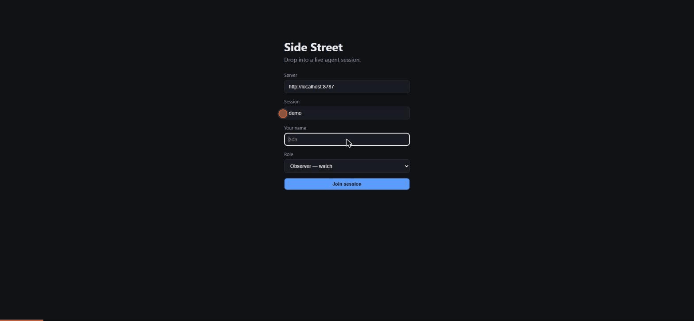

# Side Street

**The open-source multiplayer layer for coding agents.**

Anyone on your team can drop into the same live agent session — watch it work token-by-token,
steer it, hand it off, and audit exactly who told the agent what. Side Street doesn't ship its
own agent: it wraps Claude Code, Codex, Gemini CLI, and anything else that speaks the
[Agent Client Protocol](https://agentclientprotocol.com), and owns the collaboration surface
around them.



_Ada takes the wheel and asks what is breaking. Bob — a Navigator — suggests a cause, and it
lands as a **suggestion**, behind the Driver. Ada acts on it, and the agent's next step is
side-effecting, so it stops at an **approval gate** only the wheel-holder can answer. Every line
of that is in a hash-chained log with an author on it. No API key: the demo runs against the
stub agent that ships in this repo._

> **Status: pre-alpha, but runnable.** We're building in public against a phased plan — see
> [`docs/PLAN.md`](docs/PLAN.md). One command runs the whole thing with no API key; see below.
>
> **The collaboration layer (Phases 0–1).** Two humans in separate browsers co-steer one live
> agent session over ACP — shared durable timeline, Driver/Navigator/Observer roles, mid-turn
> steering, hard-interrupt, and directed "take the wheel" handoff. The session runs on a
> Cloudflare Durable Object (SQLite event log + hibernating WebSockets) with offset-based
> late-joiner replay, and a per-session E2B microVM behind the swappable sandbox interface.
>
> **Safety and durability (Phase 2).** An append-only, hash-chained event log with a server-side
> verification endpoint; per-role secret **redaction** before every broadcast _and_ every replay;
> session-scoped credentials injected only at sandbox boot and declared to the redaction pass;
> **Driver-only approval gates** on side-effecting tools, with idempotency keys that warn before
> a step runs twice and report any step an agent restart left unaccounted for; checkpoint
> compaction; reconnects that resume from a cursor; and a **red-team prompt-injection suite**
> that runs in CI on every pull request and is never weakened to make a build pass.
>
> **The wedge (Phase 3).** A **Sentry** alert opens a session already carrying what broke, one
> room per issue, signature-verified and failing closed. Sessions export as an **attributed
> Markdown postmortem** carrying the chain tip, so the write-up can be checked against the log
> rather than trusted. **Usage metering** is derived from the log rather than counted beside it.
> **Structured ops logs** carry no content by construction, which a red-team fixture enforces.
> The ACP client negotiates **authentication**, so a second backing agent attaches with a flag.
>
> **Not yet: authentication.** v0 identity is unauthenticated query params — a viewer names
> themselves _and their role_, and the agent socket accepts any connection at all. The log is
> tamper-evident, but it attributes what a socket claimed rather than who acted. Do not expose a
> deployment beyond dev; this is what gates a hosted demo, and the design is proposed in
> [ADR-0005](docs/adr/0005-authenticated-session-tokens.md). The Phase 2 exit benchmark passes
> locally (see [`docs/benchmarks/phase-2.md`](docs/benchmarks/phase-2.md)); its 24-hour soak
> against a real deployment has not been run. Phase 3's own benchmark — a pilot team running a
> real incident — is the next gate. Not production-ready.

## Run it

No API key, no account, nothing to sign up for:

```bash
pnpm install
pnpm dev
```

That brings up the Durable Object emulator, the web UI on
[localhost:5173](http://localhost:5173), and a **stub agent** — canned replies over a real ACP
stdio pipe, so everything the product actually does is exercisable without a model behind it.

Open the UI twice in two browser profiles, join session `demo` as **driver** and as
**navigator**, and:

- **take the wheel**, then steer — watch the reply stream into both windows
- send a message from the Navigator — it lands as a _suggestion_, behind the Driver
- **interrupt** mid-turn — the Driver alone can
- ask it to `deploy the fix` — the approval gate opens, and only the wheel-holder can answer
- hit **Export** — an attributed Markdown postmortem of everything that just happened
- `curl localhost:8787/session/demo/verify` — the hash chain, checked server-side

Swap in a real agent with one flag (`--agent claude-code`, `codex`, `gemini`) — see
[`docs/agents.md`](docs/agents.md).

## Why

- Agents now run tasks that take hours, days, even weeks — but every session is trapped on one person's laptop.
- Every shipping coding agent solved _single-user_ steering the same way (queue input, inject at the next tool-call boundary, hard-interrupt escape hatch). **Nobody has shipped multiple humans steering one agent.** That's what we're building.
- The moments teams already crowd around one problem — incident response, on-call debugging, senior-steers-junior mentoring — deserve better than screen-share and copy-paste.

## What it will look like

- **Shared durable sessions** — one Cloudflare Durable Object per session with an append-only event log; sessions survive laptops, reconnects, and days of wall-clock time. Late joiners replay from an offset and land in the live stream.
- **Multi-human steering** — Driver / Navigator / Observer roles, an attributed intervention queue drained at tool-call boundaries, explicit hard-interrupt, and "take the wheel" handoff.
- **Tamper-evident attribution** — every steering action, approval, and interrupt is signed into a hash-chained log. Who steered what is legible and can't be quietly rewritten.
- **A security envelope** — per-role secret redaction before anything reaches a viewer, session-scoped short-lived credentials, sandboxed execution, and human approval gates on side-effecting tools.
- **Agent-agnostic by design** — the backing agent and the sandbox are swappable interfaces, never vendor lock-in.
- **A postmortem trail you can export** — the session as an attributed Markdown timeline, carrying the chain tip so the write-up can be checked against the log rather than trusted.

## Documentation

| Doc                                                          | What it is                                                                          |
| ------------------------------------------------------------ | ----------------------------------------------------------------------------------- |
| [`docs/PLAN.md`](docs/PLAN.md)                               | The project plan — phases, architecture decisions, benchmarks. The source of truth. |
| [`docs/protocol.md`](docs/protocol.md)                       | The wire spec: event log, steering semantics, approvals, replay, transport.         |
| [`docs/agents.md`](docs/agents.md)                           | Running a session against a different backing agent, and authenticating it.         |
| [`docs/ops.md`](docs/ops.md)                                 | Operating a deployment: structured logs, what they never carry, per-session usage.  |
| [`docs/integrations/sentry.md`](docs/integrations/sentry.md) | Sentry alert to a shared session already open on the problem.                       |
| [`docs/adr/`](docs/adr/)                                     | Architecture decision records — what we chose, and what it cost.                    |
| [`docs/benchmarks/`](docs/benchmarks/)                       | Runbooks for the phase exit benchmarks.                                             |
| [`docs/research/`](docs/research/)                           | The research foundation the plan is built on.                                       |
| [`docs/releasing.md`](docs/releasing.md)                     | How versions are cut: changesets, semver, signed tags.                              |
| [`CLAUDE.md`](CLAUDE.md)                                     | The working agreement all contributors (human and agent) follow.                    |

## License

**Everything in this repository is [AGPL-3.0](LICENSE)** — permanently open, freely
self-hostable, with no feature held back. The multiplayer session layer _is_ the project, and it
is all here.

The AGPL's network copyleft means anyone who offers Side Street as a service must open-source
their modifications. That keeps closed commercial resale off the table while keeping the project
genuinely open to everyone else.

**Where the commercial line falls, stated plainly:** the paid layer is a hosted control plane —
managed infrastructure, SSO/SCIM, and compliance features — offered under a commercial license.
It is not a feature-gated fork of this code; if it ever becomes one, this paragraph is the thing
to hold us to. Contributors sign a CLA so that dual-licensing stays possible
([`CONTRIBUTING.md`](CONTRIBUTING.md)), and what they contribute stays AGPL-3.0 forever.

Being straight about this from the start is deliberate. A project that is vague about where the
money is asks its community to find out later.
